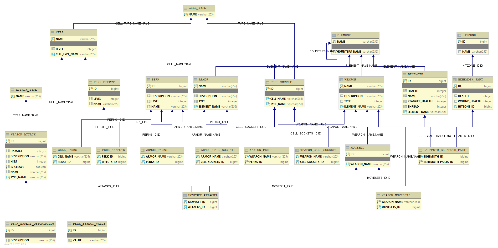

# Relentless - Dauntless© Damage Simulator

## Description

Allows for testing and comparision of user specified loadouts for effectivity in respectively specified scenarios.   

## State: *Prototyping* 

(Absolutely no point in Downloading unless you want to participate in development)

## Technical Details: 

### Data Model
(Will be outdated frequently)

### Calculation Scheme

In a nutshell: Collect but don't process mutators from all available sources. Process at last.
 

### Visualisation

In your IDE 🐟

At least until model and cases are feature complete. Writing UIs is tedious, but changing them later is devastating.

 
